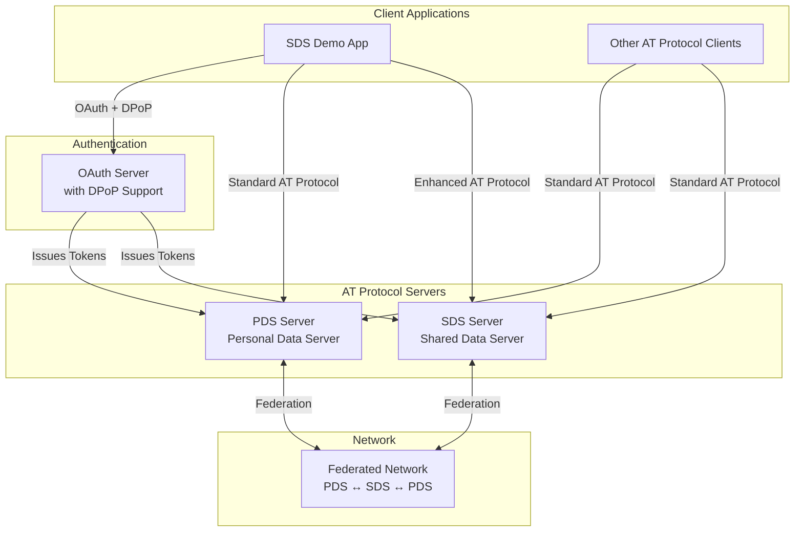
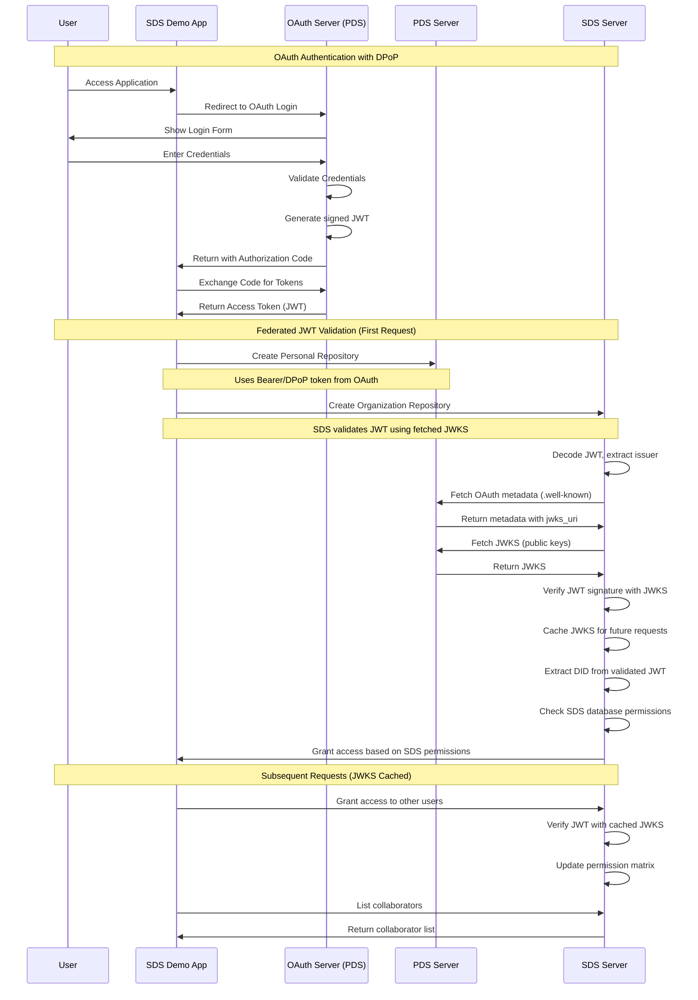
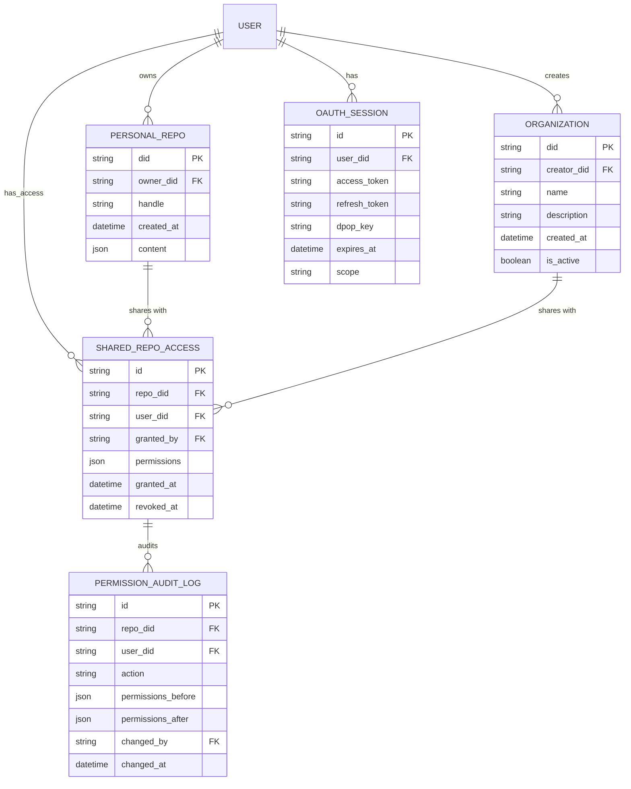
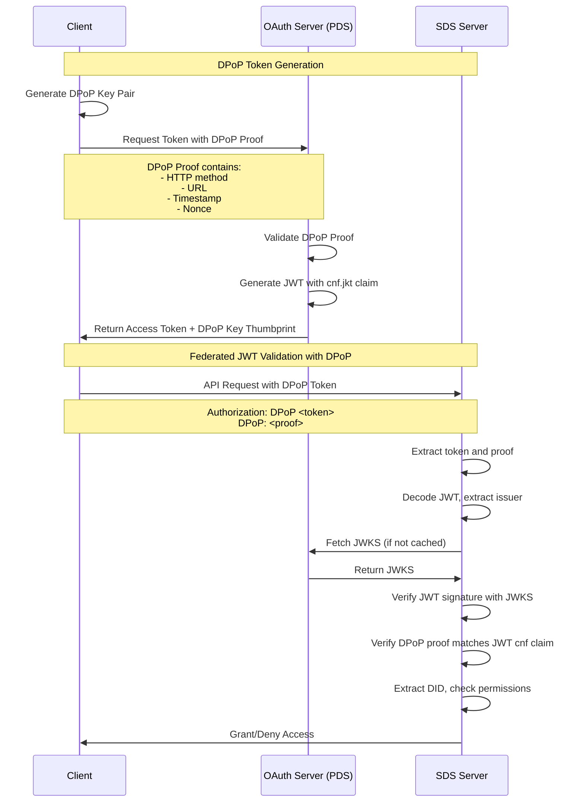

# SDS Demo App - Proof of Concept

This demo application showcases the **Shared Data Server (SDS)** implementation, demonstrating how multiple users can collaborate on shared repositories while maintaining full compatibility with the AT Protocol ecosystem.

## Overview

The SDS Demo App is a web-based application that demonstrates the core functionality of the AT Protocol Shared Data Server. It allows users to:

- **Authenticate** with both PDS and SDS servers using OAuth 2.0 with DPoP
- **Create organizations** that are actual repositories with their own DIDs
- **Share repositories** with other users through granular permission management
- **Collaborate** on content creation within shared repositories
- **Manage permissions** with real-time updates and audit trails

## Architecture Overview

### Core Components

The SDS implementation consists of three main server types:

1. **PDS (Personal Data Server)** - Standard AT Protocol data server
2. **SDS (Shared Data Server)** - Extended PDS with multi-user repository sharing
3. **OAuth Server** - Handles authentication and authorization

### Key Relationships



## Authentication Flow

The demo uses OAuth 2.0 with DPoP (Demonstrating Proof-of-Possession):

1. **User Sign-In**: User signs in with their AT Protocol handle
2. **OAuth Redirect**: OAuth client redirects to their PDS for authentication
3. **User Authorization**: User authorizes the demo app
4. **Token Issuance**: PDS issues a DPoP-bound access token
5. **Demo App Requests**: Demo app creates DPoP proofs for SDS with:
   - `Authorization: DPoP <access_token>` header
   - `DPoP: <proof_jwt>` header containing cryptographic proof
   - Uses `dpopFetchWrapper` from `@atproto/oauth-client`
6. **SDS Validation**: SDS validates the DPoP proof cryptographically
7. **Authorization**: SDS extracts user DID and checks database permissions

**Security**: DPoP tokens provide proof-of-possession, meaning even if a token is stolen, it cannot be used without the client's private key.

### Key Features

- **Cryptographic Security**: DPoP proof validation prevents token theft and forgery
- **Identity Verification**: Cryptographic proof validates caller identity
- **No Bearer Tokens**: SDS rejects insecure Bearer tokens
- **Third-Party Resource Server**: Demo shows proper DPoP usage for non-issuing servers
- **No Token Signature Validation**: SDS trusts the token content (PDS uses HS256)
- **Proof-of-Possession**: Client must possess private key bound to token
- **No OAuth Provider**: SDS is purely a Resource Server
- **Database-Only Authorization**: All access control via SDS permission database

### Trust Model

SDS as a resource server:

- Validates cryptographic proof-of-possession (DPoP proof)
- Trusts token content (DID) from any PDS without signature validation
- Relies on SDS database for all authorization decisions
- Does not manage DPoP nonces (delegates to PDS as authorization server)

This model provides strong protection against token theft while maintaining simple federation.

## Sequence Diagram: Authentication Flow



## Entity Relationship Diagram



## DPoP (Optional Enhanced Security)

### What is DPoP?

DPoP is an OAuth 2.0 extension that can optionally be used for **sender-constrained access tokens**. When used, it cryptographically binds the access token to the client's proof-of-possession key.

**Note:** The SDS federated implementation validates both Bearer and DPoP tokens locally using fetched JWKS. The `@atproto/oauth-provider` Keyset handles DPoP validation during JWT verification.

### How DPoP Works in the ATProto Network



### DPoP Security Benefits

1. **Token Binding**: Access tokens are bound to the client's private key
2. **Replay Protection**: Each request includes a unique DPoP proof
3. **Theft Prevention**: Stolen tokens cannot be used without the private key
4. **Cross-Server Security**: SDS verifies tokens from any PDS using standard JWKS
5. **Local Validation**: No network calls required after JWKS is cached

### Implementation Details

The SDS auth verifier validates tokens through federated JWT validation:

```typescript
// Federated JWT Validation Process
async oauth(options: any = {}): any {
  return async (ctx) => {
    // 1. Extract token and type from Authorization header
    const authHeader = ctx.req.headers.authorization
    const [tokenType, token] = authHeader.split(' ')

    // 2. Validate token using FederatedTokenValidator
    // This will:
    //   - Decode JWT to extract issuer
    //   - Fetch OAuth metadata from issuer
    //   - Fetch JWKS from issuer (cached for performance)
    //   - Verify JWT signature locally
    //   - Validate DPoP proof if present
    const result = await this.federatedValidator.validateToken(
      token,
      tokenType as 'Bearer' | 'DPoP'
    )

    // 3. Extract user DID from validated token
    const did = result.did
    if (!did) {
      throw new AuthRequiredError('Invalid token')
    }

    // 4. Check SDS database permissions (in endpoint handlers)
    return { credentials: { type: 'oauth', did } }
  }
}
```

## Key Features Demonstrated

### 1. Multi-Server Authentication

- **PDS Integration**: Standard AT Protocol authentication
- **SDS Integration**: Enhanced authentication with cross-server token verification
- **OAuth with DPoP**: Secure token binding and verification

### 2. Repository Sharing

- **Organization Creation**: Real repositories with DIDs for organizations
- **Permission Management**: Granular read/write/admin permissions
- **Collaborator Management**: Add/remove users with real-time updates
- **Audit Trail**: Complete history of permission changes

### 3. Cross-Server Token Validation

- **Federated JWT Validation**: SDS validates tokens locally using JWKS fetched from the issuing PDS
- **Dynamic Discovery**: SDS discovers OAuth metadata and JWKS automatically from any PDS
- **Trust Model**: SDS trusts all PDS instances to correctly sign tokens and provide accurate JWKS
- **Permission Management**: Authorization entirely through SDS database permissions
- **No Scope Validation**: OAuth scopes are not validated by SDS
- **JWKS Caching**: Public keys cached for optimal performance

### 4. Real-Time Collaboration

- **Live Updates**: Collaborator lists update in real-time
- **Permission Changes**: Immediate reflection of permission grants/revokes
- **Activity Feed**: Audit trail of all collaboration activities

## Technical Implementation

### Frontend (React + TypeScript)

- **Multi-Server Agent**: Smart routing between PDS and SDS servers
- **React Query**: Optimistic updates and caching
- **OAuth Integration**: Seamless authentication flow
- **Real-Time UI**: Live updates for collaboration features

### Backend (Node.js + TypeScript)

- **SDS Server**: Extended PDS with sharing capabilities
- **Permission Manager**: RBAC system with audit logging
- **Auth Verifier**: Cross-server token validation
- **API Endpoints**: SDS-specific collaboration endpoints

### Database Schema

- **Shared Repository Permissions**: Multi-user access control
- **Permission Audit Log**: Complete audit trail
- **OAuth Sessions**: Token management with DPoP support

## Getting Started

### Prerequisites

- Node.js 18+
- Docker (for database and Redis)
- pnpm package manager

### Installation

```bash
# Install dependencies
make deps

# Build all packages
make build

# Start development environment
make dev
```

### Running Against Local Dev Environment

**Important:** You need to run TWO separate processes - the backend dev environment AND the demo app.

#### Terminal 1: Start Backend Services

```bash
# Start all backend services (PDS, SDS, Bsky, Ozone, etc.)
make run-dev-env
```

This will start:

- **PDS (Personal Data Server)**: http://localhost:2583
- **SDS (Shared Data Server)**: http://localhost:2585
- **PLC Directory**: http://localhost:2582
- **Bsky Appview**: http://localhost:2584
- **Ozone**: http://localhost:2587

#### Terminal 2: Start Demo App

```bash
# Start the demo app dev server
cd packages/sds-demo && pnpm run dev
```

The demo app will be available at: **http://localhost:8080**

#### Creating a Local Account

**⚠️ IMPORTANT:** You MUST use local test handles, not production Bluesky handles!

1. **Create a local account first:**

   - Navigate to http://localhost:2583 (local PDS)
   - Click "Create Account"
   - Use a `.test` handle (e.g., `alice.test`)
   - Set a password

2. **Sign in to the demo:**

   - Navigate to http://localhost:8080
   - Click "Sign In"
   - Enter your `.test` handle (e.g., `alice.test`)
   - You'll be redirected to the **local PDS** OAuth screen
   - Authorize the app

3. **Create and manage organizations:**
   - Once signed in, you can create organizations
   - Share them with collaborators
   - Manage permissions

#### Troubleshooting

If you're being redirected to Bluesky production (bsky.social):

- ✅ **Check your handle**: Make sure you're using a `.test` or `.example` handle, NOT a `.bsky.social` handle
- ✅ **Clear browser storage**: Clear all application data (cookies, localStorage, IndexedDB)
- ✅ **Check browser console**: Look for configuration logs showing localhost URLs
- ✅ **Verify services are running**: Ensure `make run-dev-env` is running in the background

Expected console output when properly configured:

```
[SDS Demo Config] {
  ENV: 'development',
  isLocalhost: true,
  hostname: 'localhost',
  PLC_DIRECTORY_URL: 'http://localhost:2582',
  HANDLE_RESOLVER_URL: 'http://localhost:2584',
  SIGN_UP_URL: 'http://localhost:2583',
  SDS_SERVER_URL: 'http://localhost:2585'
}
```

## Security Considerations

### Token Security

- **Federated JWT Validation**: Tokens validated locally using standard OAuth 2.0 JWT verification
- **JWKS Discovery**: Public keys fetched dynamically from issuing PDS
- **Trust Model**: SDS trusts all PDS instances to correctly sign tokens and provide accurate JWKS
- **DID Extraction**: User identity extracted from validated JWT claims
- **Expiration Handling**: JWT expiration validated during signature verification
- **DPoP Support**: Optional DPoP validation for enhanced token binding

### Permission Security

- **RBAC Implementation**: Role-based access control for repositories
- **Audit Logging**: Complete trail of all permission changes
- **Input Validation**: Comprehensive validation of all inputs
- **Error Handling**: Secure error messages without information disclosure

### Cross-Server Security

- **Standard OAuth 2.0**: Uses widely-adopted Resource Server pattern
- **Local Validation**: JWT validation happens locally (after JWKS fetch)
- **Network Trust**: Relies on PDS to correctly sign tokens and provide accurate JWKS
- **Permission Database**: All authorization managed in SDS database
- **Rate Limiting**: Protection against abuse and DoS attacks
- **JWKS Caching**: Minimizes external dependencies for token validation

## Future Enhancements

### Phase 2: Advanced Features

- **Content Creation**: Enable creating posts/records in shared repositories
- **Advanced Permissions**: Role-based access beyond read/write
- **Real-Time Collaboration**: Live editing and presence indicators
- **Mobile Support**: React Native implementation

### Phase 3: Production Features

- **Scalability**: Horizontal scaling and load balancing
- **Monitoring**: Comprehensive logging and metrics
- **Backup/Recovery**: Data protection and disaster recovery
- **Compliance**: GDPR, SOC2, and other regulatory requirements

## Contributing

This is a reference implementation demonstrating production-grade DPoP authentication for AT Protocol resource servers. For production deployment, additional operational considerations such as performance optimization, monitoring, and comprehensive testing would be required.

## License

This project is part of the AT Protocol reference implementation and follows the same licensing terms.
