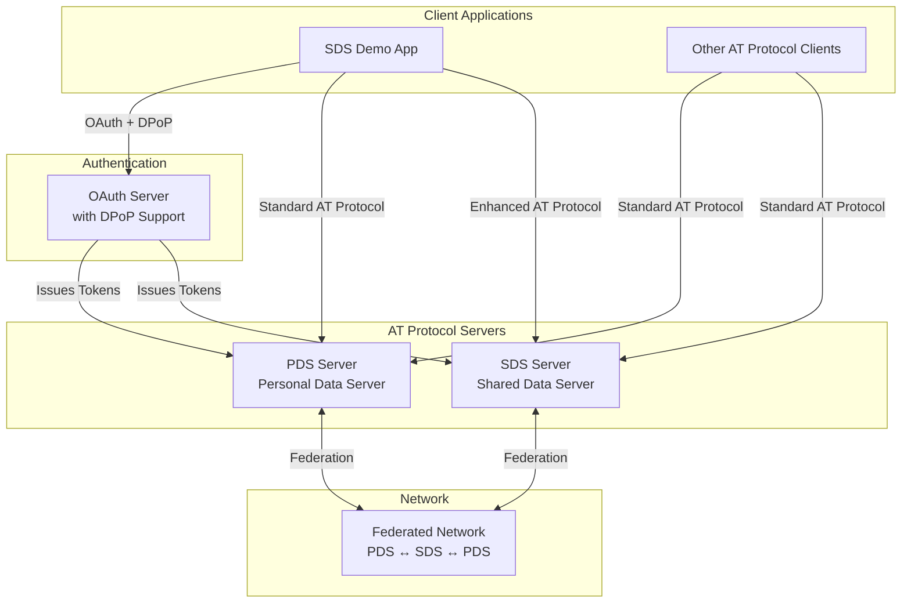
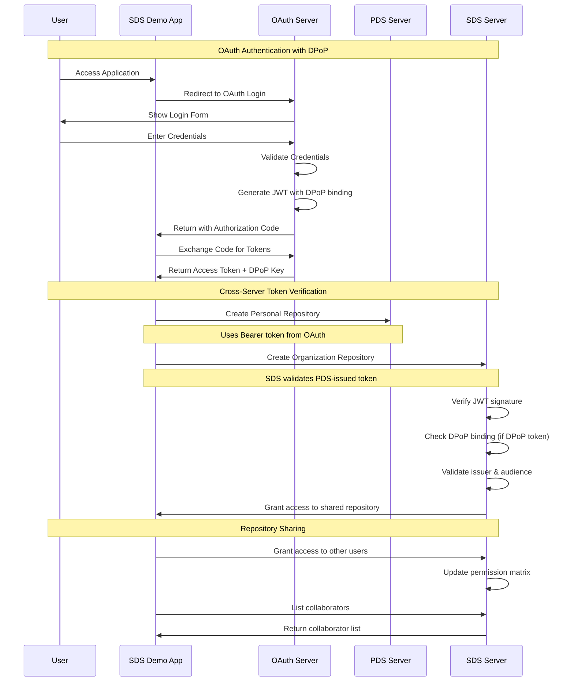
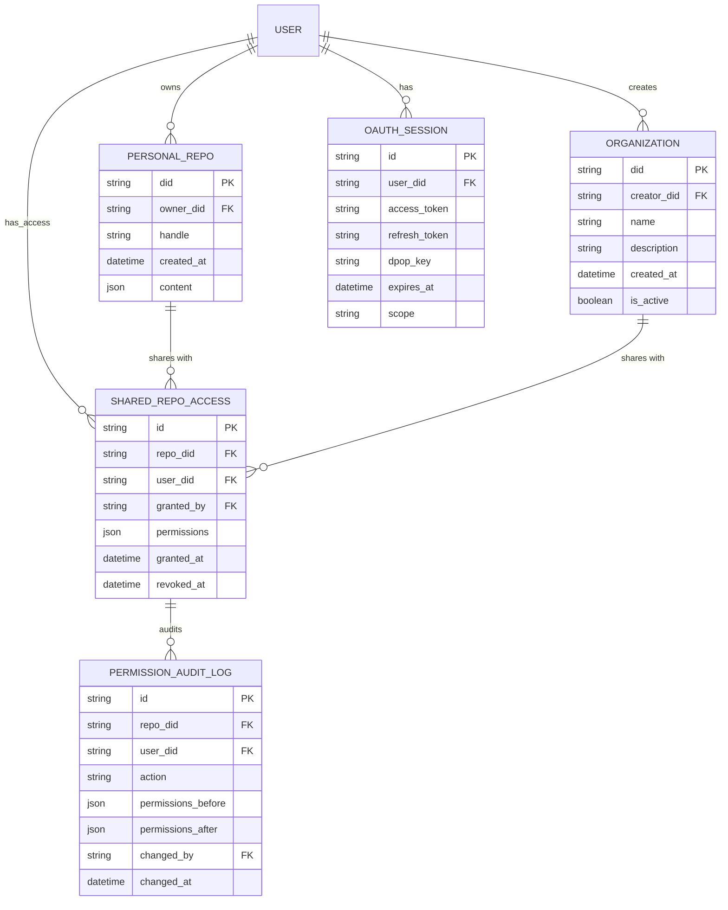
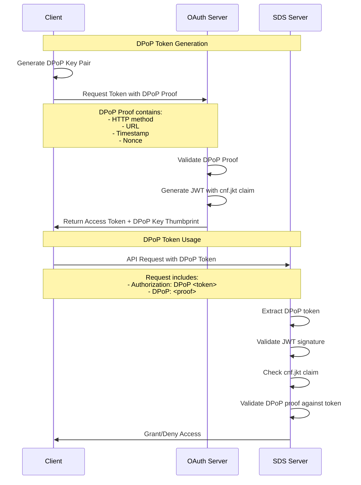

# SDS Demo App - Proof of Concept

This demo application showcases the **Shared Data Server (SDS)** implementation, demonstrating how multiple users can collaborate on shared repositories while maintaining full compatibility with the AT Protocol ecosystem.

## Overview

The SDS Demo App is a web-based application that demonstrates the core functionality of the AT Protocol Shared Data Server. It allows users to:

- **Authenticate** with both PDS and SDS servers using OAuth 2.0 with DPoP
- **Create organizations** that are actual repositories with their own DIDs
- **Share repositories** with other users through granular permission management
- **Collaborate** on content creation within shared repositories
- **Manage permissions** with real-time updates and audit trails

## Architecture Overview

### Core Components

The SDS implementation consists of three main server types:

1. **PDS (Personal Data Server)** - Standard AT Protocol data server
2. **SDS (Shared Data Server)** - Extended PDS with multi-user repository sharing
3. **OAuth Server** - Handles authentication and authorization

### Key Relationships



## Sequence Diagram: Authentication Flow



## Entity Relationship Diagram



## DPoP (Demonstrating Proof-of-Possession) Verification

### What is DPoP?

DPoP is an OAuth 2.0 extension that provides **sender-constrained access tokens**. It cryptographically binds the access token to the client's proof-of-possession key, preventing token theft and replay attacks.

### How DPoP Works in SDS



### DPoP Security Benefits

1. **Token Binding**: Access tokens are bound to the client's private key
2. **Replay Protection**: Each request includes a unique DPoP proof
3. **Theft Prevention**: Stolen tokens cannot be used without the private key
4. **Cross-Server Security**: SDS can verify tokens issued by PDS with confidence

### Implementation Details

The SDS auth verifier handles DPoP tokens through the following process:

```typescript
// DPoP Token Validation Process
private async validateJwtToken(token: string, req: any): Promise<any> {
  // 1. Validate JWT format and structure
  if (!this.isValidJwtFormat(token)) {
    throw new AuthRequiredError('Invalid token format')
  }

  // 2. Decode and validate JWT claims
  const decoded = this.decodeTokenBasic(token)

  // 3. Verify issuer is trusted
  if (!this.isTrustedIssuer(decoded.iss)) {
    throw new AuthRequiredError('Untrusted token issuer')
  }

  // 4. Verify audience is valid
  if (!this.isValidAudience(decoded.aud)) {
    throw new AuthRequiredError('Invalid token audience')
  }

  // 5. For DPoP tokens, validate key binding
  if (decoded.cnf?.jkt) {
    await this.validateDpopBinding(token, decoded, req)
  }

  return decoded
}
```

## Key Features Demonstrated

### 1. Multi-Server Authentication

- **PDS Integration**: Standard AT Protocol authentication
- **SDS Integration**: Enhanced authentication with cross-server token verification
- **OAuth with DPoP**: Secure token binding and verification

### 2. Repository Sharing

- **Organization Creation**: Real repositories with DIDs for organizations
- **Permission Management**: Granular read/write/admin permissions
- **Collaborator Management**: Add/remove users with real-time updates
- **Audit Trail**: Complete history of permission changes

### 3. Cross-Server Token Verification

- **PDS → SDS**: SDS validates tokens issued by PDS
- **Security Validation**: JWT signature, issuer, audience, and DPoP binding
- **Permission Mapping**: OAuth scopes mapped to repository access levels

### 4. Real-Time Collaboration

- **Live Updates**: Collaborator lists update in real-time
- **Permission Changes**: Immediate reflection of permission grants/revokes
- **Activity Feed**: Audit trail of all collaboration activities

## Technical Implementation

### Frontend (React + TypeScript)

- **Multi-Server Agent**: Smart routing between PDS and SDS servers
- **React Query**: Optimistic updates and caching
- **OAuth Integration**: Seamless authentication flow
- **Real-Time UI**: Live updates for collaboration features

### Backend (Node.js + TypeScript)

- **SDS Server**: Extended PDS with sharing capabilities
- **Permission Manager**: RBAC system with audit logging
- **Auth Verifier**: Cross-server token validation
- **API Endpoints**: SDS-specific collaboration endpoints

### Database Schema

- **Shared Repository Permissions**: Multi-user access control
- **Permission Audit Log**: Complete audit trail
- **OAuth Sessions**: Token management with DPoP support

## Getting Started

### Prerequisites

- Node.js 18+
- Docker (for database and Redis)
- pnpm package manager

### Installation

```bash
# Install dependencies
make deps

# Build all packages
make build

# Start development environment
make dev
```

### Running the Demo

```bash
# Start SDS server
cd packages/sds
npm run dev

# Start demo app
cd packages/sds-demo
npm run dev
```

## Security Considerations

### Token Security

- **JWT Signature Verification**: All tokens validated against issuer public keys
- **DPoP Binding**: Tokens bound to client private keys
- **Audience Validation**: Tokens only valid for intended services
- **Expiration Handling**: Automatic token refresh and validation

### Permission Security

- **RBAC Implementation**: Role-based access control for repositories
- **Audit Logging**: Complete trail of all permission changes
- **Input Validation**: Comprehensive validation of all inputs
- **Error Handling**: Secure error messages without information disclosure

### Cross-Server Security

- **Issuer Validation**: Only trusted issuers can create valid tokens
- **Signature Verification**: Cryptographic validation of all tokens
- **Scope Mapping**: OAuth scopes properly mapped to repository permissions
- **Rate Limiting**: Protection against abuse and DoS attacks

## Future Enhancements

### Phase 2: Advanced Features

- **Content Creation**: Enable creating posts/records in shared repositories
- **Advanced Permissions**: Role-based access beyond read/write
- **Real-Time Collaboration**: Live editing and presence indicators
- **Mobile Support**: React Native implementation

### Phase 3: Production Features

- **Scalability**: Horizontal scaling and load balancing
- **Monitoring**: Comprehensive logging and metrics
- **Backup/Recovery**: Data protection and disaster recovery
- **Compliance**: GDPR, SOC2, and other regulatory requirements

## Contributing

This is a proof-of-concept implementation. For production use, additional security reviews, performance optimization, and comprehensive testing would be required.

## License

This project is part of the AT Protocol reference implementation and follows the same licensing terms.
